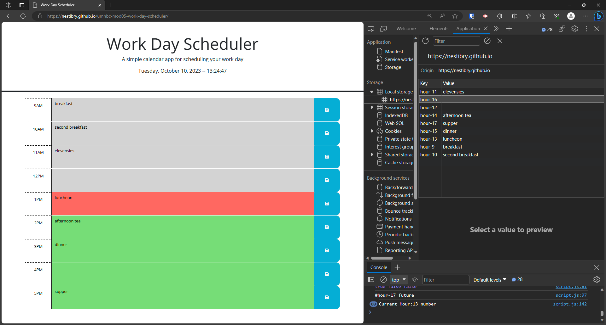

# Module 5 Challenge - Work Day Scheduler
*University of Minnesota - Coding Boot Camp*

## Description
Simple calendar application that allows a user to save events for each hour of a typical working day (9am-5pm).
- The app features a responsive user interface (dynamically updating the HTML/CSS styling and powered by jQuery). 
- User submits a calendar event this is stored in local storage and maintains state on the UI if user reloads browser.
- Displays current local time using [Day.js](https://day.js.org/en/)

## Installation

N/A

## Usage

Deployed Site: https://nestibry.github.io/umnbc-mod05-work-day-scheduler/

Files: 
- HTML: index.html
- Styling: ./assets/css/style.css
- jQuery JavaScript: ./assets/js/script.js

Figure: Saved Schedule Example

 
## Credits
- [Day.js](https://day.js.org/en/)
- © 2023 edX Boot Camps LLC.

## License

[MIT License](https://choosealicense.com/licenses/mit/)

